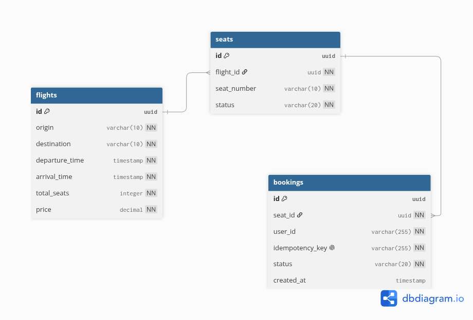

# Architecture

## Current Architecture

```text
Client
  |
  v
Backend
```

## Planned Architecture

```text
                        Client / Travel Aggregators
                                  |
                                  | REST (HTTP/TLS)
                                  v
                          Gateway Service
                      (FastAPI - Auth, Rate Limit,
                          Routing)
                                  |
                +-----------------+-----------------+
                |                                    |
                | gRPC                               | gRPC
                v                                    v
        Search Service                     Inventory Service
        (FastAPI gRPC worker)              (FastAPI gRPC worker)
                |                                    |
                | READ                               | SET NX / Lua
                v                                    v
            Redis                                 Redis
       (search cache, TTL)                  (seat locks, AOF)
                                                     |
                                                     | WRITE (ACID)
                                                     v
                                              PostgreSQL
                                       (bookings, idempotency keys)
```

### Two consistency paths

- **AP path (Search):** Gateway -> Search Service -> Redis cache.
  Optimized for availability and low latency. Cache misses fall back to
  PostgreSQL.
- **CP path (Booking):** Gateway -> Inventory Service -> Redis lock ->
  PostgreSQL. Optimized for correctness. Every write is guarded by a
  distributed lock and an idempotency key.

## Data Model



### Entities

**flights**
- `id` (PK)
- `origin`, `destination`
- `departure_time`, `arrival_time`
- `total_seats`
- `price`

**seats**
- `id` (PK)
- `flight_id` (FK -> flights)
- `seat_number`
- `status` (`available`, `booked`)

**bookings**
- `id` (PK)
- `seat_id` (FK -> seats)
- `passenger_name`
- `idempotency_key` (UNIQUE)
- `status` (`confirmed`, `failed`)
- `created_at`

### Redis key patterns

- `seat:{flight_id}:{seat_id}:lock` -> `{uuid_token}` (TTL 720s)
- `search:{query_hash}` -> cached flight results (TTL 60s)

## Responsibilities

### Gateway Service

* Accept and validate incoming requests
* Enforce per-key rate limiting (100 req/min)
* Route search requests to the Search Service via gRPC
* Route booking requests to the Inventory Service via gRPC
* Translate internal gRPC errors into HTTP status codes
  (e.g. lock conflict -> `423 Locked`)

### Search Service

* Query PostgreSQL for flight availability
* Cache results in Redis with a short TTL
* Serve cached results when available (AP path)

### Inventory Service

* Acquire distributed seat locks via Redis `SET NX` with TTL
* Run the Lua confirm/release script for atomic token validation
* Re-check seat availability in PostgreSQL if the lock has expired
  before payment confirmation (webhook recovery flow)
* Commit confirmed bookings to PostgreSQL using idempotency keys
* Release locks on booking failure or cancellation

### Redis

* Store search result cache (short TTL, AP path)
* Store seat locks with TTL (CP path), persisted via AOF so locks
  survive a restart without a separate cleanup worker

### PostgreSQL

* Store flights, seats, and bookings
* Enforce `idempotency_key` uniqueness to make booking writes safe to retry
