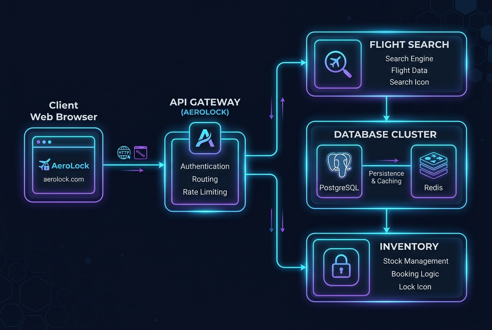

# Architecture

## System Architecture Diagram



## Planned Architecture

```text
                        Client / Travel Aggregators
                                  |
                                  | REST (HTTP/TLS)
                                  v
                          Gateway Service
                      (FastAPI - Auth Validation, Rate Limit,
                          Routing)
                                  |
            +---------------------+---------------------+
            |                     |                     |
            | gRPC                | gRPC                | gRPC
            v                     v                     v
    Search Service         Inventory Service       User Service
    (gRPC Searcher)        (gRPC Booker)           (gRPC Cryptographer)
            |                     |                     |
            | READ                | SET NX / Lua        | JWT signing
            v                     v                     v
        Redis                  Redis                PostgreSQL
   (search cache, TTL)    (seat locks, AOF)        (users ledger)
                                  |
                                  | WRITE (ACID)
                                  v
                           PostgreSQL
                    (bookings, idempotency keys, passengers)
```

### Consistency Paths

- **AP path (Search):** Gateway -> Search Service -> Redis cache. Optimized for availability and low latency. Cache misses fall back to PostgreSQL.
- **CP path (Booking):** Gateway -> Inventory Service -> Redis lock -> PostgreSQL. Optimized for correctness. Every write is guarded by a distributed lock and an idempotency key. Requires authentication token validated via Gateway.
- **Security Path (Auth):** Gateway -> User Service. Generates secure RS256 JWT signatures for stateless validation.

---

## Data Model

### Entities

**users**
- `id` (PK, UUID)
- `username` (VARCHAR, UNIQUE)
- `hashed_password` (VARCHAR, using native bcrypt)

**flights**
- `id` (PK, UUID)
- `origin`, `destination` (VARCHAR)
- `departure_time`, `arrival_time` (TIMESTAMP)
- `total_seats` (INTEGER)
- `price` (DECIMAL)

**seats**
- `id` (PK, UUID)
- `flight_id` (FK -> flights)
- `seat_number` (VARCHAR)
- `status` (`available`, `booked`)

**bookings**
- `id` (PK, UUID)
- `seat_id` (FK -> seats)
- `user_id` (FK -> users)
- `idempotency_key` (UNIQUE)
- `pnr` (VARCHAR, passenger record locator)
- `total_price` (DECIMAL)
- `status` (`confirmed`, `failed`)
- `created_at` (TIMESTAMP)

**passengers**
- `id` (PK, UUID)
- `booking_id` (FK -> bookings)
- `name` (VARCHAR)
- `passport_number` (VARCHAR)

---

## Responsibilities

### Gateway Service
* Accept and validate incoming REST requests.
* Intercept requests to `/booking/confirm` using `get_current_user` dependency to mathematically verify RS256 JWT.
* Route search, booking, and auth requests to their respective gRPC backend services.

### User Service
* Salt and hash user passwords using native `bcrypt`.
* Manage the SQL ledger for user credentials.
* Sign asymmetric JWTs using the secure RS256 private key.

### Search Service
* Query PostgreSQL for flight availability.
* Cache results in Redis with a short TTL (60s).

### Inventory Service
* Acquire distributed seat locks via Redis `SET NX` with TTL (720s).
* Run the Lua confirm/release script for atomic token validation.
* Commit confirmed bookings and maps passengers inside PostgreSQL under an ACID transaction.
